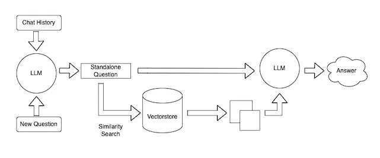

# Takweed-GPT

GPT 🧠 for chat with CSV, PDF, TXT files 🤖 and YTB videos 🔴 | using Langchain 🐦 | OpenAI | Streamlit



## Running Locally 💻

Follow these steps to set up and run the service locally :

### Prerequisites

- Docker
- Python3

### Installation

Clone the repository :

`git clone git@github.com:Mahaseel-Lab/Takweed-GPT.git`

Navigate to the project directory :

`cd Takweed-GPT`

Create a virtual environment :

```bash
python -m venv .venv
.\.venv\Scripts\activate
```

Install and Launch the chat service locally :

`pip install -r requirements.txt`

`streamlit run src/Home.py`

#### That's it! The service is now up and running locally.

## Contributing 🙌

If you want to contribute to this project, please open an issue, submit a pull request or contact me at ahmed.khaled@mahaseel.net 🤗
